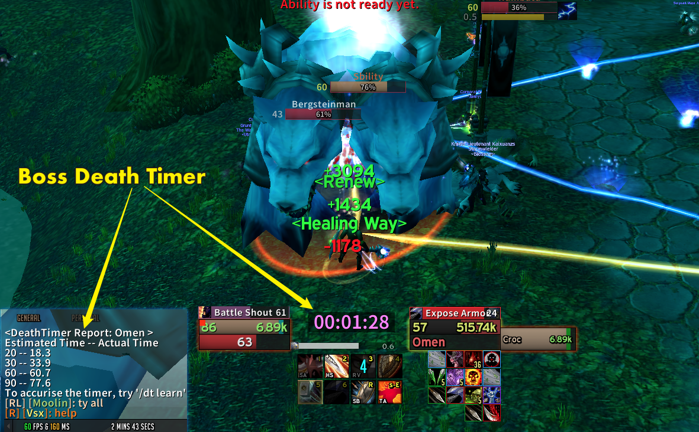

# Boss Death Timer
Boss Death Timer is a Vanilla World of Warcraft addon that provides a simple countdown timer displayed on the Boss enemy’s target frame. It estimates the remaining time until the boss dies based on the damage taken over time during combat.

## Features

- **Countdown Timer:**  
  Shows an easy-to-read timer that estimates when the boss will die.
- **Adjustable Settings:**  
  Change font size, damage thresholds, and update intervals to fit your style.
- **Alert Colors:**  
  The timer changes color as the boss nears death to catch your eye.
- **Simple Commands:**  
  Use chat commands like `/bdt toggle`, `/bdt fontsize`, `/bdt health`, and more to customize your experience.

## Installation (Vanilla, 1.12)
1. Download **[Latest Version](https://github.com/ZenSociety/BossDeathTimer/archive/master.zip)**
2. Unpack the Zip file
3. Rename the folder "BossDeathTimer-main" to "BossDeathTimer"
4. Copy "BossDeathTimer" into Wow-Directory\Interface\AddOns
5. Restart WoW game client.

## How It Works

Imagine you have a yummy ice cream cone that’s slowly melting on a hot day. In our addon, the boss’s health is like that melting ice cream. Our job is to guess how long it will take for the ice cream (or the boss) to completely melt away!

There are two key ideas that make this prediction work:

• Minimum Damage Threshold (/bdt health):  
This is like saying, “We only start our countdown when a good, noticeable chunk of ice cream has melted!” If just a little drop goes off, we don’t care, because it might just be a tiny drip. The addon waits until enough damage is dealt—just like waiting until enough ice cream melts—to begin tracking time.

• Average Intervals (/bdt average):  
Imagine you check the melting ice cream several times at regular intervals. Instead of guessing based on just one look, you average all your observations together. This helps you get a smoother and more accurate idea of how fast the ice cream is disappearing. In the addon, we take several damage measurements over set intervals. By averaging these, the addon can better predict when the boss’s health will run out, much like figuring out when your ice cream will be all gone.

This clever combination of waiting for enough damage (melting) and averaging multiple observations helps the addon forecast the countdown timer accurately during a boss fight.

You can paste this section into your README.md file to give users an easy-to-understand explanation of how the addon works!

## Commands
Use the following commands in the chat to control the addon:

- `/bdt toggle`  
  Shows or hides the death timer frame during combat.
- `/bdt fontsize <number>`  
  Changes the font size of the timer. (Default is 20.)
- `/bdt health <number>`  
  Sets the minimum damage threshold that triggers an update. (Default is 1000.)
- `/bdt average <number>`  
  Adjusts the average update interval used for calculations. (Default is 40.)
- `/bdt list`  
  Lists the current alert seconds values.
- `/bdt add <number>`  
  Adds a new alert second value.
- `/bdt delete <number>`  
  Removes an alert second value.
- `/bdt reset`  
  Restores all settings back to their default values.
- `/bdt about`  
  Displays the addon version, author information, and a brief description.
